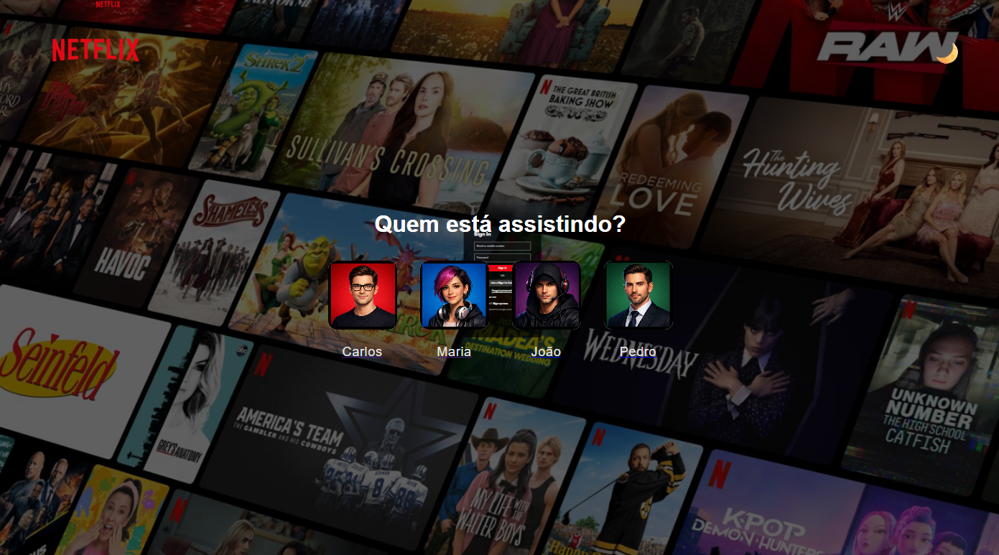
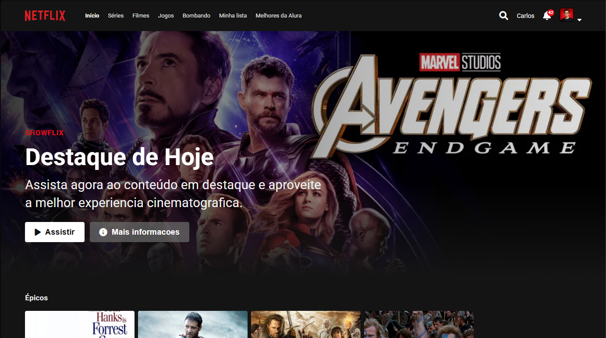

# 🎬 Netflix Clone - Projeto Alura

Um projeto de clone da Netflix desenvolvido durante uma **imersão da Alura**, onde revisei conceitos fundamentais de desenvolvimento web e aprimorei minhas habilidades utilizando **GitHub Copilot** como assistente de programação.


## 📋 Sobre o Projeto

Este projeto simula a experiência de uso da plataforma Netflix, incluindo:
- Seleção de perfil de usuário
- Vídeo de transição entre telas
- Página de catálogo com carrossel de filmes
- Suporte a tema claro e escuro
- Interface responsiva e intuitiva

## 🎯 Funcionalidades

✅ **Seleção de Perfil** - Escolha entre múltiplos perfis de usuário com animações suaves  
✅ **Vídeo de Transição** - Reprodução de vídeo ao selecionar um perfil  
✅ **Catálogo Dinâmico** - Carrosséis de filmes organizados por categorias  
✅ **Tema Claro/Escuro** - Alternância entre modos com wallpapers personalizados  
✅ **Efeitos Visuais** - Hover effects, bordas interativas e transições suaves  
✅ **Responsividade** - Adaptação para diferentes tamanhos de tela  

## 🛠️ Tecnologias Utilizadas

- **HTML5** - Estrutura semântica das páginas
- **CSS3** - Estilização, gradientes e animações
- **JavaScript** - Lógica interativa e controle de temas
- **GitHub Copilot** - Assistência na programação, compreensão e otimização de código

## 📁 Estrutura do Projeto

```
alura_netflix/
├── index.html                 # Página inicial (seleção de perfil)
├── README.md                  # Documentação
├── assets/
│   ├── script.js             # Script principal do index
│   ├── style.css             # Estilos globais
│   ├── transition-video.css  # Estilos do vídeo de transição
│   ├── intro.mp4             # Vídeo de transição
│   ├── black_back.png        # Wallpaper - Modo escuro
│   └── write_back.jpg        # Wallpaper - Modo claro
└── catalogo/
    ├── catalogo.html         # Página de catálogo
    ├── catalogo.css          # Estilos do catálogo
    └── js/
        ├── data.js           # Dados dos filmes
        ├── main.js           # Lógica principal do catálogo
        ├── utils.js          # Funções utilitárias
        └── components/
            ├── Card.js       # Componente de card de filme
            └── Carousel.js   # Componente de carrossel
```


## 🚀 Como Usar

### Instalação
1. Clone ou baixe este repositório
2. Abra o arquivo `index.html` em um navegador moderno

### Navegação
1. Selecione um perfil clicando em uma das fotos
2. Aguarde o vídeo de transição
3. Explore o catálogo de filmes
4. Use o botão de tema no canto superior direito para alternar entre modo claro/escuro

## 📚 Aprendizados e Diferencial

Este projeto foi desenvolvido com foco em **aprendizado prático** e **uso de IA para potencializar a produtividade**:

🤖 **GitHub Copilot como Ferramenta de Aprendizado**
- Utilizei o Copilot para entender padrões de código e melhores práticas
- A IA ajudou na otimização e refatoração de código
- Explorei sugestões do Copilot para explorar alternativas de solução

📖 **Reforço de Conceitos Fundamentais**
- Manipulação do DOM e eventos JavaScript
- Transições e animações CSS
- Gerenciamento de estado com localStorage
- Componentização e reutilização de código

🎨 **Aprimoramento de UI/UX**
- Design system com tema claro/escuro
- Efeitos visuais e feedback ao usuário
- Experiência responsiva e intuitiva

## 🎓 Imersão Alura

Este projeto foi desenvolvido durante uma **Imersão da Alura**, onde:
- Revisei conceitos básicos de HTML, CSS e JavaScript
- Aprendi a estruturar projetos de forma profissional
- Consolidei conhecimentos através de prática hands-on
- Integrei ferramentas modernas de desenvolvimento (Copilot) no workflow

## 🔧 Melhorias Futuras

- [ ] Integração com API de filmes (TMDB)
- [ ] Sistema de login/autenticação
- [ ] Página de detalhes do filme
- [ ] Funcionamento real do catálogo
- [ ] Sistema de favoritos
- [ ] Reprodutor de vídeo funcional

## 🤝 Créditos

- **Alura** - Imersão e conteúdo educativo
- **GitHub Copilot** - Assistência em desenvolvimento e compreensão de código
- **Netflix** - Inspiração no design e funcionalidades

## 📝 Links do Projeto

- Segue lá no Github: [https://github.com/alexandrecmlopes](https://github.com/alexandrecmlopes)
- Segue lá no Linkedin: [https://www.linkedin.com/in/alexandre-lopes-98b0a0333/](https://www.linkedin.com/in/alexandre-lopes-98b0a0333/)


